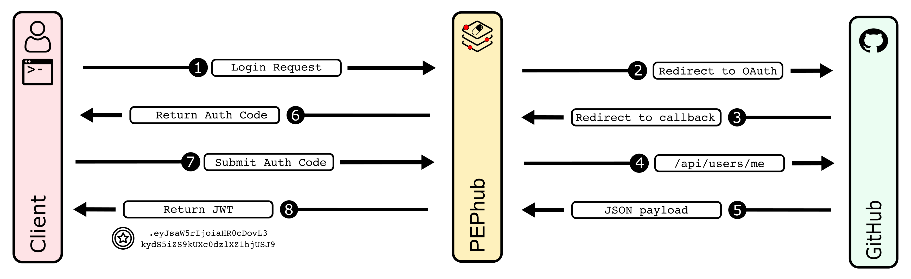
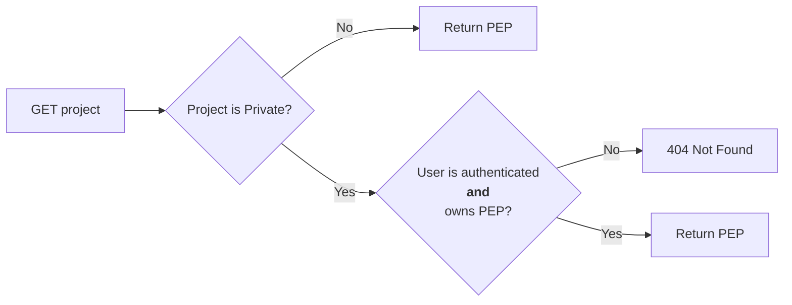
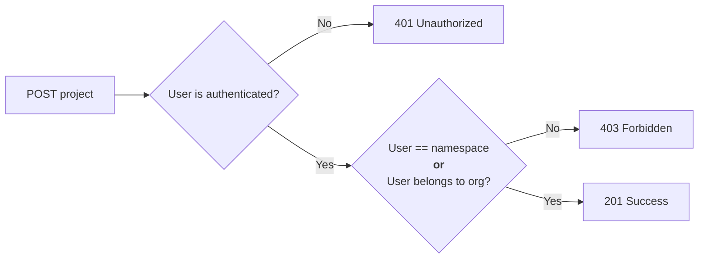
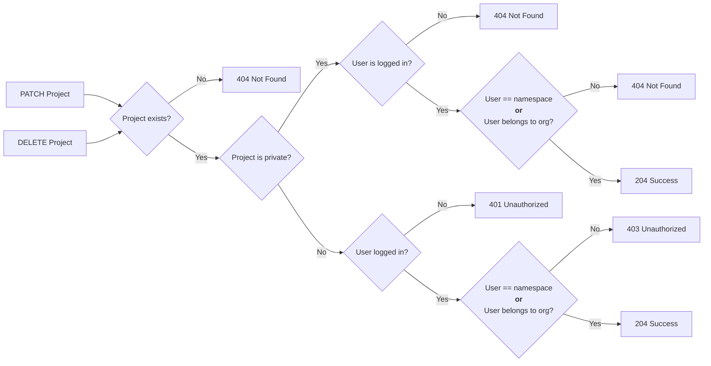

# PEPhub Authentication
*Nathan LeRoy, January 13th, 2023*
## Introduction
*pephub* supports authentication. We use [GitHub OAuth](https://docs.github.com/en/developers/apps/building-oauth-apps/authorizing-oauth-apps) as an authorization provider and user/namespace management system. There are two kinds of namespaces in *pephub*: **User namespaces** and **organization namespaces**. User namespaces are just that: namespaces that contain PEPs submitted by a user who has authenticated from GitHub. For example, my GitHub username/namespace is **nleroy917**. So, my *pephub* namespace (once I authenticate) is also **nleroy917**. Organization namespaces contain PEPs submitted by users who belong to that organization on GitHub. For example, I (**nleroy917**) belong to the **databio** organization on GitHub. As such, once authenticated I can read and write PEPs to this namespace on *pephub*.

*pephub* supports both **reading** and **writing** PEPs. Just like GitHub, all PEPs are by default available to view by all users. Users may choose to mark a PEP as **private** and any attempts to **read** or **write** to this PEP will require prior authorization. For example, if I submit a new PEP at `nleroy917/yeast-analysis:latest` and mark it as **private**. I must first authenticate, and then I will be able to **read** and **write** to this PEP.

## Authorization Flow
### Overview
PEPhub has a specific authorization flow to support software that integrates with the API and make authorized requests. We use [JSON Web Tokens (JWTs)](https://jwt.io/) to authorize requests that access private information. Once the JWT is obtained, you can include it as a header to make requests to the API and retrieve private data for a particular user. JWTs are user-specific, and require GitHub log in to obtain. We take advantage of the [authorization code flow](https://auth0.com/docs/get-started/authentication-and-authorization-flow/authorization-code-flow) to achieve this.

### Obtaining a JWT
Obtaining a JWT for a user happens in three steps: 1) Login request with PEPhub, 2) Redirect with authorization code, 3) Exchange authorization code for a JWT. Details and examples of each step are given below:



#### Login request with PEPhub
The first step is to request authorization from the user, so your app can access to PEPhub resources on behalf of that user. To do so, your application must build and send a `GET` request to the `/auth/login` endpoint. An optional `client_redirect_uri` query parameter may be supplied so PEPhub knows where to redirect the request once an authorization code has been generated.

*FastAPI example:*
```python
from typing import Optional
from fastapi import FastAPI
from fastapi.responses import RedirectResponse

BASE_URL = "https://pephub.databio.org"

app = FastAPI()

@app.get("/login")
async def login(client_redirect_uri: Optional[str]):
    if client_redirect_uri:
        auth_url = f"{BASE_URL}/auth/login?client_redirect_uri={client_redirect_uri}"
    else:
        auth_url = f"{BASE_URL}/auth/login"
    return RedirectResponse(auth_url)
```

*React SPA example:*
```tsx
const LoginButton = () => {
  const BASE_URL = 'https://pephub.databio.org'
  const client_redirect_uri = 'https://my-domain.com/callback'
  return (
    <a href={`${BASE_URL}/auth/login?client_redirect_uri=${client_redirect_uri}`}>
        Log in to PEPhub
    </a>
  )
}
```

The user will be directed to GitHub to login and authorize PEPhub to obtain information on their account.

#### Redirect with authorization code
If the GitHub log in is successful, PEPhub will either redirect to its `/auth/login/success` endpoint, or the requesting client's `client_redirect_uri` if supplied with an authorization code as a query parameter. For example: `https://my-domain.com/callback?code=NApCCg..BkWtQ`. The app is now ready to exchange the authorization code for a JWT. It can do this by making a `POST` request to the `/auth/token` endpoint. The body of this `POST` request must contain the following parameters encoded in `application/json`:
| Field                 | Value                                                                                 |
|-----------------------|---------------------------------------------------------------------------------------|
| `code`                | *Required* The authorization code obtained from the previous request                  |
| `client_redirect_uri` | *Optional* The `client_redirect_value` (if any) used to obtain the authorization code |

*FastAPI*
```python
import httpx
from fastapi import FastAPI
from fastapi.responses import RedirectResponse

BASE_URL = "https://pephub.databio.org"
CLIENT_REDIRECT_URI = "https://my-domain.com/callback"

app = FastAPI()

@app.get("/callback")
async def login(code: str):
    payload = {
      'code': code,
      'client_redirect_uri': CLIENT_REDIRECT_URI
    }
    res = httpx.post(f"{BASE_URL}/auth/token", json=payload)
    return {
        'token': res.json()['token']
    }
```

*React SPA*
```tsx
import { useEffect, useMemo } from 'react'
import { useLocation, redirect } from 'react-router-dom'
import { useCookies } from 'react-cookie'
import { exchangeCodeForToken } from '../utils'

const API_BASE = import.meta.env.VITE_BASE_URL
const CLIENT_REDIRECT = import.meta.env.VITE_CLIENT_REDIRECT_URI

const LoginSuccess = () => {
    // cookies
    const [cookies, setCookie] = useCookies(['pephub_session']);
    const [token, setToken] = useState(undefined)

    // url params
    const location = useLocation()
    const params = useMemo(() => {
        const searchParams = new URLSearchParams(location.search)
        return Object.fromEntries(searchParams.entries())
    }, [location.search])

    // watch for changes and get JWT to set cookie
    useEffect(() => {
        if(params.code) {
            exchangeCodeForToken(params.code)
            .then((token) => setToken(token))
        }
    }, [params.code])

    return (
        <div className="container mx-auto px-4 h-screen">
            <div className="h-full flex flex-col items-center justify-center">
                
                <p className="text-4xl font-bold">Logging in...</p>
                <p className="mt-3">
                    If you are not redirected in 5 seconds... 
                    <a className="text-blue-600 ml-2" href="/">click here</a>
                </p>
            </div>
        </div>
    )
}

export default LoginSuccess
```

#### Using JWT to make requests
Once the JWT is obtained, you can use it to make authorized requests on the user's behalf. To do so, simply include the token as an authorization header. For example: `Authorization: Bearer user-jwt-token`

*Python*
```python
import httpx

hdrs = {
   'Authorization': "Bearer ey38fh421r....fqw"
}

res = httpx.get(
  "https://pephub.databio.org/api/v1/projects/nleroy917/my-private-pep",
  headers=hdrs
)
```

*JavaScript/TypeScript*
```ts
fetch(
  'https://pephub.databio.org/api/v1/projects/nleroy917/my-private-pep',
  {
    method: 'GET',
    headers: {
      Authorization: 'Bearer ey54y29r....3r31'
    }
  }
)
.then((res) => res.json())
.then((data) => console.log(res.data))
```

### Examples
We have provided two examples that utilize the PEPhub authorization flow: 1) a [python command-line interface](https://github.com/pepkit/example-pephub-cli) and 2) and [React-based single-page application](https://github.com/pepkit/example-pephub-spa).

## Setting Up GitHub OAuth For Your Own Server
If you wish to run your own *pephub* server, you will need to set up your own GitHub OAuth application. This is a simple process. First, you will need to create a new GitHub OAuth application. Detailed instructions can be found in the [GitHub documentation](https://docs.github.com/en/developers/apps/building-oauth-apps/creating-an-oauth-app). You will need to set the following fields:
- Homepage URL: `http://localhost:8000`.
- Authorization callback URL: `http://localhost:8000/auth/callback`.

You do not need to enable device flow. Once you have created your application, you will be given a `Client ID` and can now generate a `Client secret`. Finally, you will need to set these values in your *pephub* server's environment variables. You can do this by manually exporting them with `export GH_CLIENT_ID=...` and `export GH_CLIENT_SECRET=...` or by curating your `.env` file with the following variables:
- `GH_CLIENT_ID`: The client ID of your GitHub OAuth application.
- `GH_CLIENT_SECRET`: The client secret of your GitHub OAuth application.
- `REDIRECT_URI`: The redirect URI of your GitHub OAuth application.

## Reading PEPs
Anyone can **read** all PEPs that are not marked as **private** without any authentication. If a user wishes to **read** a PEP marked as **private**, they must 1) Authenticate, and 2) be the owner of that PEP **or** belong to the organization that owns that PEP. In the interest of privacy, any access to a PEP that is marked as **private** without prior authorization will result in a `404` response.



This flow should be identical to the flow that GitHub uses to protect repositories.

## Writing PEPs
### Submiting a new PEP
There are two scenerios for PEP submission: 1) A user submits to their namespace, and 2) A user submits to an organization. Both cases must require authentication. A user may freely submit PEPs to their own namespace. However, only **members** of an organization may submit PEPs to that organization. See below chart:



### Editing an existing PEP
If a user wishes to **edit** an existing PEP, they must authenticate and satisfy one of two requirements: 1) The PEP belongs to their namespace, or 2) The PEP belongs to organization of which that user is a member.

### Deleting a PEP
If a user wishes to **delete** an existing PEP, they must authenticate and satisfy one of two requirements: 1) The PEP belongs to their namespace, or 2) The PEP belongs to organization of which that user is a member. See the below flow chart:


