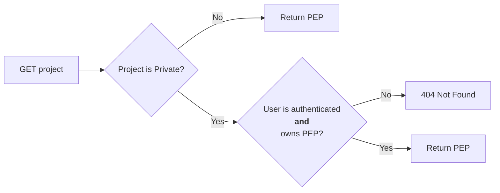
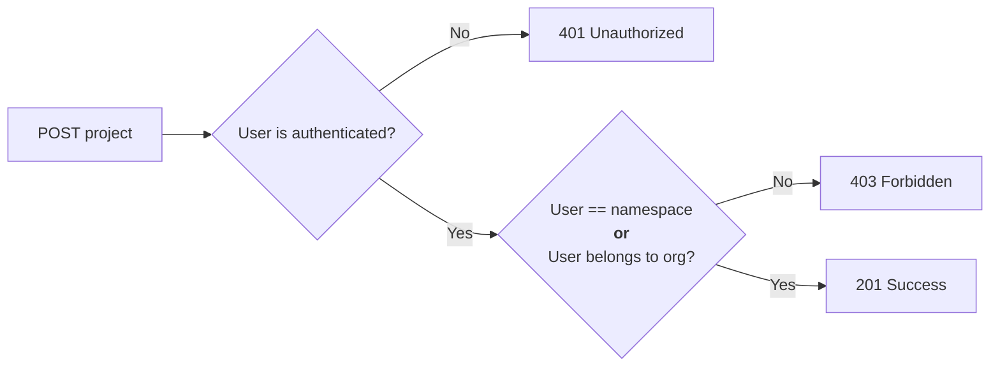
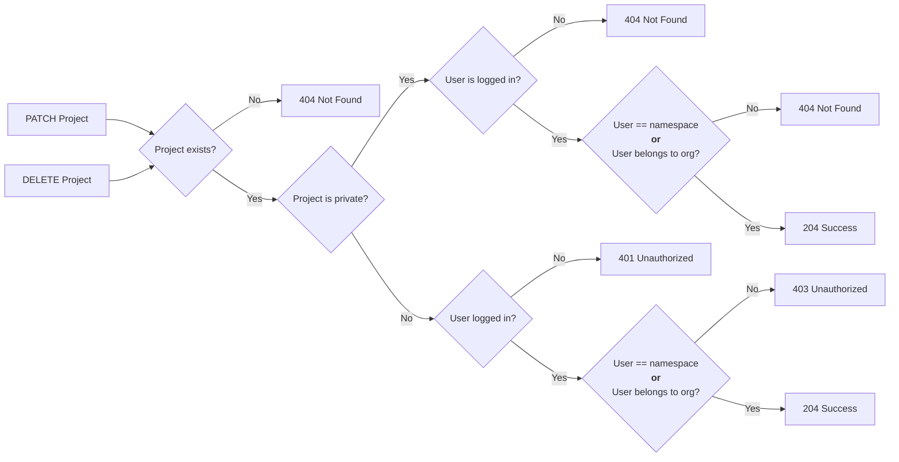

# PEPhub Authentication
*Nathan LeRoy, January 13th, 2023*
## Overview
*pephub* supports authentication. We use [GitHub OAuth](https://docs.github.com/en/developers/apps/building-oauth-apps/authorizing-oauth-apps) as an authorization provider and user/namespace management system. There are two kinds of namespaces in *pephub*: **User namespaces** and **organization namespaces**. User namespaces are just that: namespaces that contain PEPs submitted by a user who has authenticated from GitHub. For example, my GitHub username/namespace is **nleroy917**. So, my *pephub* namespace (once I authenticate) is also **nleroy917**. Organization namespaces contain PEPs submitted by users who belong to that organization on GitHub. For example, I (**nleroy917**) belong to the **databio** organization on GitHub. As such, once authenticated I can read and write PEPs to this namespace on *pephub*.

*pephub* supports both **reading** and **writing** PEPs. Just like GitHub, all PEPs are by default available to view by all users. Users may choose to mark a PEP as **private** and any attempts to **read** or **write** to this PEP will require prior authentication. For example, if I submit a new PEP at `nleroy917/yeast-analysis:latest` and mark it as **private**. I must first authenitcate, and then I will be able to **read** and **write** to this PEP.

## Reading PEPs
Anyone can **read** all PEP's that are not marked as **private** without any authentication. If a user wishes to **read** a PEP marked as **private**, they must 1) Authenticate, and 2) be the owner of that PEP **or** belong to the organization that owns that PEP. In the interest of privacy, any access to a PEP that is marked as **private** without prior authorization will result in a `404` response.

This flow should be identical to the flow that GitHub uses to protect repositories.

## Writing PEPs
Authentication for writing PEPs is more complex. Provisions are made at both the namespace and the project level to protect unauthorized writing of PEPs to the database.

### Submiting a new PEP
There are two scenerios for PEP submission: 1) A user submits to their namespace, and 2) A user submits to an organization. Both cases must require authentication. A user may freely submit PEPs to their own namespace. However, only **members** of an organization may submit PEPs to that organization. See below chart:

### Editing an existing PEP
If a user wishes to **edit** an existing PEP, they must authenticate and satisfy one of two requirements: 1) The PEP belongs to their namespace, or 2) The PEP belongs to organization of which that user is a member.

### Deleting a PEP
If a user wishes to **delete** an existing PEP, they must authenticate and satisfy one of two requirements: 1) The PEP belongs to their namespace, or 2) The PEP belongs to organization of which that user is a member. See the below flow chart:

