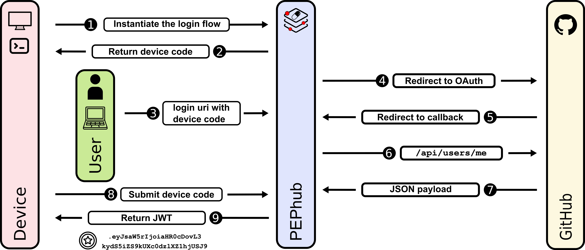

# PEPhub device authentication

## Introduction
PEPhub supports device authentication using a simplified version of the [OAuth 2.0 Device Authorization Grant](https://www.rfc-editor.org/rfc/rfc8628).
 This authentication method is intended for devices that do not have a browser, or for command-line tools, in order to simplify the authentication process. 
PEPhub device authentication is based on the general [PEPhub Authentication](./authentication.md) 
, with additional steps added specifically for device authentication.

## Authorization Flow
Authorization Flows contains steps that are described in the figure below.

1. The device initiates the login flow by sending a POST request to the PEPhub server. (The server creates a temporary device code and saves the user's IP address as one of the values in a dictionary.)

2. In response, the device receives a code to be used for further authorization through a browser by the user. 
3. The user opens a browser and enters the URL with the device code received in the previous step. 
4. The server checks if the device code exists and redirects the user to the GitHub OAuth page. 
5. GitHub redirects the user to the PEPhub callback with a GitHub user token. 
6. PEPhub sends requests to GitHub to get the user's information.
7. PEPhub retrieves a JSON payload and creates a JWT token and temporarily saves it linked to the device code in the dictionary. 
8. The device sends a POST request to PEPhub with the device code. The server returns the JWT and deletes the temporarily stored information about it. 
9. The device receives the JWT.

